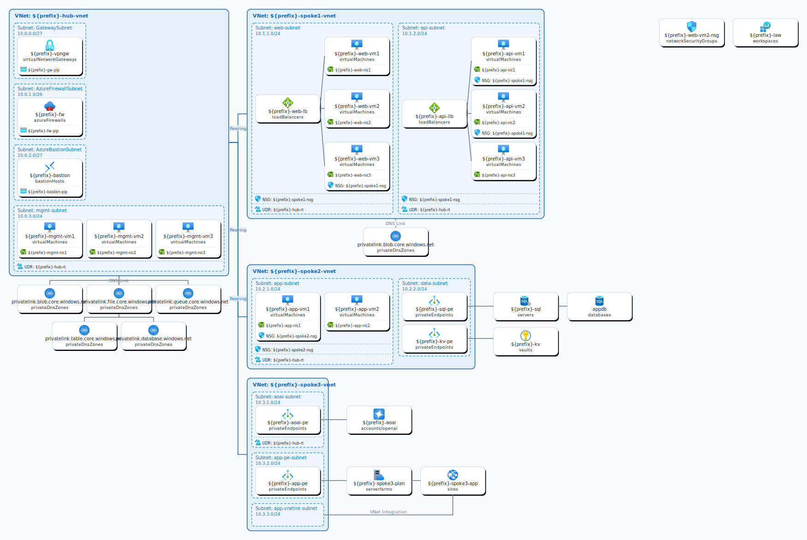

# AzDiagram

Azure Bicep テンプレートから SVG アーキテクチャ図を生成する Go 製 CLI ツールです。

ブログ記事やハンズオン資料などで使う「ちょっとした構成図」を、手書きせずに Bicep テンプレートから自動生成することを目的として作成しています。

## サンプル



[`example.bicep`](examples/example.bicep) から上記の [`example.svg`](examples/example.svg) を以下のコマンドで生成できます。

```bash
azdiagram -i ./azure-icons -o ./examples/example.svg ./examples/example.bicep
```

## 用途

- ブログや登壇資料用の Azure 構成図を PowerPoint を使わずに作りたい
- ハンズオン用の Bicep から、配布用 SVG を自動生成したい
- Hub & Spoke や Private Endpoint を含む構成をざっくり可視化したい

## 機能

- Bicep テンプレートを解析して SVG を出力
- Hub & Spoke VNet レイアウトを自動検出・描画
- サブネット、NSG、Route Table、Load Balancer、Private Endpoint などの関係を可視化
- Microsoft 公式 Azure アーキテクチャアイコン（オプション）を使用

## 注意

- 本ツールは、単一の bicep ファイルを利用することを想定しています。モジュールを利用した複雑な bicep ファイルには対応していません
- Bicep ファイルを正規表現でパースしているので、リソースの設定や依存関係を完璧に反映していません

## インストール

### アイコンのダウンロード（推奨）

[Releases](https://github.com/kongou-ae/AzDiagram/releases) から最新の `azdiagram_windows_amd64.zip` をダウンロードして回答してください

## 使い方

公式アイコンをダウンロード・展開したうえで、`-i` で展開先フォルダを指定して使います。

```bash
# 基本
azdiagram -i ./azure-icons main.bicep

# 出力ファイルを指定
azdiagram -i ./azure-icons -o architecture.svg main.bicep

# すべてのリソース種別を描画
azdiagram -i ./azure-icons --all main.bicep

# 描画するリソース種別を絞り込む
azdiagram -i ./azure-icons --include-types "Microsoft.Compute/virtualMachines,Microsoft.Network/virtualNetworks" main.bicep
```

## オプション

| フラグ | 短縮 | 説明 |
|---|---|---|
| `--output` | `-o` | 出力 SVG ファイルパス（省略時: `diagram-YYYYMMDDHHMMSS.svg`） |
| `--icons-dir` | `-i` | 公式 Azure アーキテクチャアイコンの SVG が入ったディレクトリ |
| `--all` | | すべてのリソース種別を描画（※後述） |
| `--include-types` | | 描画するリソース種別をカンマ区切りで指定 |

## デフォルトで描画されるリソース種別

以下のリソース種別が既定で描画対象です。`--all` を指定するとすべてのリソース種別を描画しますが、デフォルト以外の種別については描画結果が正しく整形されるかの確認は行っていません。

> **注意:** `--all` は機能として提供していますが、デフォルト以外のリソース種別を含むテンプレートでレイアウトが崩れる場合があります。

- `Microsoft.Network/virtualNetworks`
- `Microsoft.Network/virtualNetworks/virtualNetworkPeerings`
- `Microsoft.Network/loadBalancers`
- `Microsoft.Network/networkSecurityGroups`
- `Microsoft.Network/networkInterfaces`
- `Microsoft.Network/privateEndpoints`
- `Microsoft.Network/privateDnsZones`
- `Microsoft.Network/privateDnsZones/virtualNetworkLinks`
- `Microsoft.Network/publicIPAddresses`
- `Microsoft.Network/azureFirewalls`
- `Microsoft.Network/virtualNetworkGateways`
- `Microsoft.Network/bastionHosts`
- `Microsoft.Network/routeTables`
- `Microsoft.Compute/virtualMachines`
- `Microsoft.KeyVault/vaults`
- `Microsoft.Sql/servers` / `Microsoft.Sql/servers/databases`
- `Microsoft.Storage/storageAccounts`
- `Microsoft.OperationalInsights/workspaces`
- `Microsoft.CognitiveServices/accounts` (Azure OpenAI)
- `Microsoft.Web/serverfarms`
- `Microsoft.Web/sites`

## ライセンス

MIT License — 詳細は [LICENSE](LICENSE) を参照してください。
